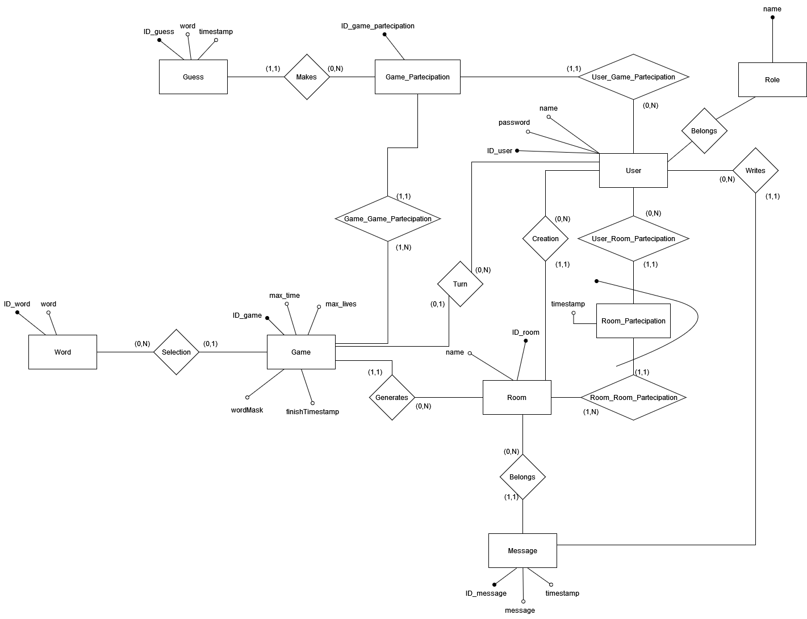

# 1 Idea

Il progetto si basa sul gioco dell'impiccato, in cui i giocatori hanno un certo numero di tentativi per indovinare una parola scelta dal server da una lista predefinita, e per ogni tentativo gli viene indicato quanto vicini o meno erano alla soluzione.

## 1.1 Modalità di gioco
I giocatori hanno vite condivise, ricevono gli stessi indizi e a turno provano a indovinare la parola. Ogni turno ha una durata limitata.

## 1.2 Stanze
### 1.2.1 Gestione
Ogni utente al menù principale ha la possibilità di creare una stanza o unirsi a una già esistente. Alla creazione di una stanza l'utente deve fornire:
- nome stanza (suggerito nomeutente's room)

Il creatore di una stanza all'interno della stanza, prima di iniziare una partita deve fornire:
- tempo massimo dper il turno di ogni giocatore
- vite massime

Può premere il pulsanto di avvio per far iniziare la partita.

Se il creatore della stanza esce, la stanza si chiude

Un utente non può unirsi alla stanza mentre una partita è in corso.

### 1.2.2 Chat
All'interno di ogni stanza di gioco è disponibile una chat in cui i giocatori possono comunicare, ogni messaggio è accompagnato dal nome del mittente.

# 2 Risorse
Saranno implementate REST API per interagire con le seguenti risorse:
- **Utente**
- **Stanza**
- **Lista parole**

# 3 Gioco
Viene scelto l'ordine dei giocatori, che a ogni turno provano a indovinare la parola. In caso sia sbagliata viene persa una vita per tutti. Se il turno scade semplicemente si passa al giocatore successivo.

# 4 Database
Il gioco si basa su un database SQL per salvare i dati. Di seguito verranno mostrati il diagramma ER e lo schema relazionale.
## 4.1 Diagramma ER

## 4.2 Schema Relazionale
## 4.2.1 Word
- ID_word (chiave primaria)
- word (30 caratteri)
- language (15 caratteri)

## 4.2.2 Role
- name (chiave primaria)

## 4.2.3 User	
- ID_user (chiave primaria)
- name (unico, 15 caratteri)
- password
- role (chiave esterna in Role)

## 4.2.4 Room
- ID_room (chiave primaria)
- name (32 caratteri)
- ID_host (chiave esterna in User)

## 4.2.5 Game
- ID_game (chiave primaria)
- max_time (maggiore di 0)
- max_lives (maggiore di 0)
- ID_room (chiave esterna in room)
- ID_word (chiave esterna in word)
- finishTimestamp (default NULL)

## 4.2.6 Message
- ID_message (chiave primaria)
- message (128 caratteri)
- timestamp
- ID_user (chiave esterna in user)
- ID_room (chiave esterna in room)

## 4.2.7 Game_Participation
- ID_game_participation (chiave primaria)
- ID_game (chiave esterna in game)
- ID_user (chiave esterna in user)

## 4.2.8 Room_Partecipation
- ID_room (chiave esterna in room)
- ID_user (chiave esterna in user)

ID_room e ID_user compongono la chiave primaria

## 4.2.9 Guess:
- ID_Guess (chiave primaria)
- word (30 caratteri)
- timestamp
- ID_game_participation (chiave esterna in game_participation)

# 5 Applicazione
## 5.1 Tecnologie
Per la realizzazione dell'applicazione sono stati usati HTML, CSS, PHP, Javascript (utilizzando anche la libreria jQuery in particolar modo per le chiamate Ajax).
Client e server comunicano tramite chiamate Ajax. In alcuni casi è necessario ci sia uno stream tra client e server per sincronizzare i client, per far ciò si utilizzano i Server Side Events (SSE).

## 5.2 Pagine
In questa sezione verranno illustrate tutte le pagine web che compongono il sito e il loro funzionamento
### 5.2.1 Login
### 5.2.2 Signup
### 5.2.3 userHome
### 5.2.4 roomList
### 5.2.5 createRoom
